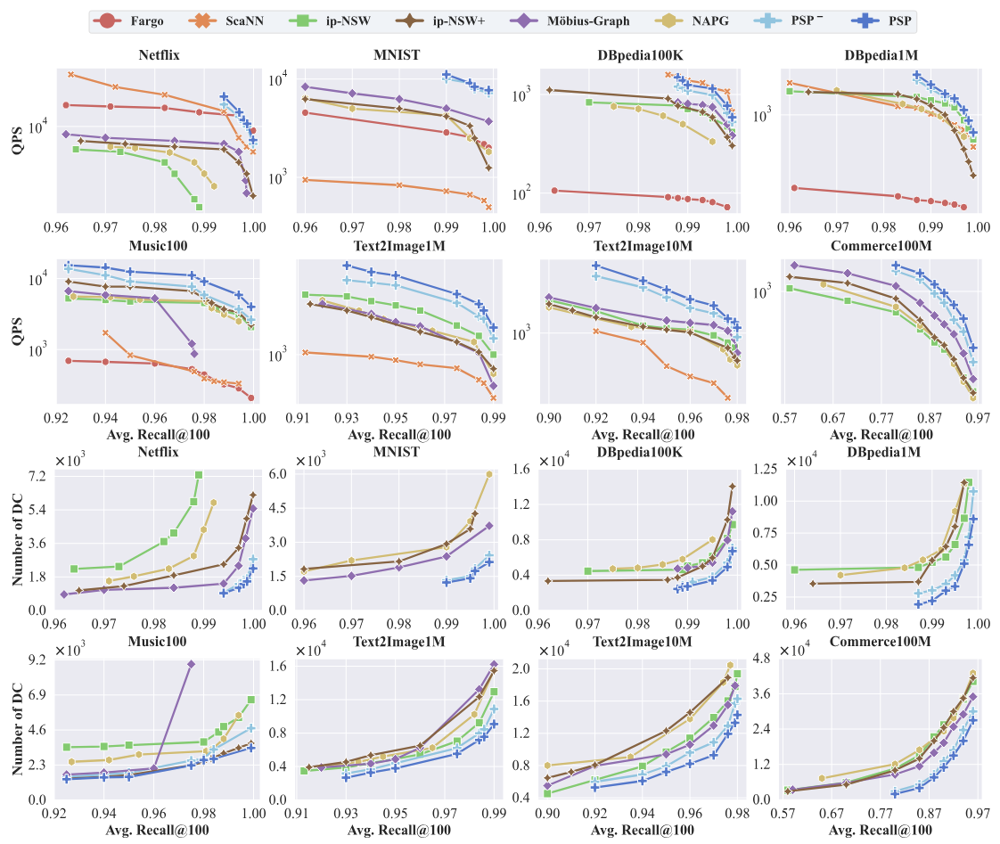

# PSP

This repository contains the source code for our paper: **Maximum Inner Product is Query-Scaled Nearest Neighbor**.

## 1 Abstract

This paper presents a novel theoretical framework that equates MIPS with NNS without requiring space transformation, thereby allowing us to leverage advanced graph-based indices for NNS and efficient edge pruning strategies, significantly reducing unnecessary computations. 

## 2 Competitors

* ip-NSW ([Paper](https://proceedings.neurips.cc/paper_files/paper/2018/file/229754d7799160502a143a72f6789927-Paper.pdf)): A graph based method using inner product navigable small world graph.
* ip-NSW+ ([Paper](https://aaai.org/ojs/index.php/AAAI/article/view/5344/5200)): An enhancement of ip-NSW that introduces an additional angular proximity graph.
* Möbius-Graph ([Paper](https://proceedings.neurips.cc/paper/2019/file/0fd7e4f42a8b4b4ef33394d35212b13e-Paper.pdf)): A graph based method that reduces the MIPS problem to an NNS problem using Möbius transformation. Since the original code is not available, we implemented a version based on the paper.
* NAPG ([Paper](https://dl.acm.org/doi/abs/10.1145/3447548.3467412)): A recent graph-based method claiming state-of-the-art performance by improving ip-NSW with a specialized metric, using an adaptive $\alpha$ for different norm distributions.
* Fargo ([Paper](https://www.vldb.org/pvldb/vol16/p1100-zheng.pdf)): The latest state-of-the-art LSH based method with theoretical guarantees.
* ScaNN ([Paper](http://proceedings.mlr.press/v119/guo20h/guo20h.pdf)): The state-of-the-art quantization method.

## 3 Datasets

The data format is: Number of vector (n) * Dimension (d).

*: Data source withheld for anonymity during review; will be released upon publication.

| Dataset                                                      | Base Size   | Dim  | Query Size | Modality   |
| ------------------------------------------------------------ | ----------- | ---- | ---------- | ---------- |
| Netflix ([link](https://github.com/xinyandai/similarity-search/tree/mipsex/data/netflix)) | 17,770      | 300  | 1,000      | Video      |
| MNIST ([link](https://yann.lecun.com/exdb/mnist/index.html)) | 60,000      | 784  | 10,000     | Image      |
| DBpedia100K ([link](https://huggingface.co/datasets/Qdrant/dbpedia-entities-openai3-text-embedding-3-large-3072-100K)) | 100,000     | 3072 | 1,000      | Text       |
| DBpedia1M ([link](https://huggingface.co/datasets/Qdrant/dbpedia-entities-openai3-text-embedding-3-large-1536-1M)) | 1,000,000   | 1536 | 1,000      | Text       |
| Music100 ([link](https://github.com/stanis-morozov/ip-nsw))  | 1,000,000   | 100  | 10,000     | Audio      |
| Text2Image1M ([link](https://research.yandex.com/blog/benchmarks-for-billion-scale-similarity-search)) | 1,000,000   | 200  | 100,000    | Multi      |
| Text2Image10M ([link](https://research.yandex.com/blog/benchmarks-for-billion-scale-similarity-search)) | 10,000,000  | 200  | 100,000    | Multi      |
| Commerce100M*                                                | 100,279,529 | 48   | 64,111     | E-commerce |

## 4 Building Instruction

### Prerequisites

- GCC 4.9+ with OpenMP
- CMake 2.8+
- Boost 1.55+
- Faiss (optional)

### Compile On Linux

```shell
$ mkdir build/ && cd build/
$ cmake ..
$ make -j
```

## 5 Usage

### Code Structure

- **datasets**: datasets
- **include**: C++ class interface
- **output**: PSP index, k-MIP result file
- **script**: some scripts to run the experiments
- **src**: main function implementation
- **test**: test codes

### How to use

#### Step 1. Build kNN Graph

Firstly, we need to prepare a kNN graph.  You can use Faiss and other libs.

#### Step 2. PSP indexing

```shell
./test/test_mips_index DATA_PATH KNNG_PATH L R Angle PSP_PATH DIM
```

- `DATA_PATH` is the path of the base data in `bin` format.
- `KNNG_PATH` is the path of the pre-built kNN graph in *Step 1.*.
- `L` candidate pool size.
- `R`maximum out-degree.
- `Angle` minimal angle between edges.
- `PSP_PATH` is the path of the generated PSP index.
- `DIM` dimension of dataset.

#### Step 3. QSA* searching

```shell
./test/test_mips_search DATA_PATH QUERY_PATH PSP_PATH searh_L K RESULT_PATH DIM
```

- `DATA_PATH` is the path of the base data in `bin` format.
- `QUERY_PATH` is the path of the query data in `bin` format.
- `PSP_PATH` is the path of the generated PSP index.
- `search_L` search pool size, the larger the better but slower (must larger than K).
- `K` the result size.
- `PSP_PATH` is the path of the result neighbors.
- `DIM` dimension of dataset.

## 6 Performance

#### Evaluation Metric

- QPS, Distance computation (for graph-based method)


